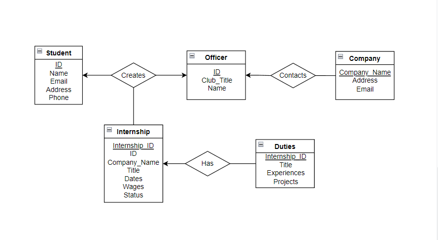

# InternshipDB
Database application for Professor Allen's Intro to Data Engineering final group project

## Explanation
---
This application is composed of two different systems: the text interface and the API which connects to the database and acts as a 'server' even though they're both running locally on your machine. 

This program uses **FastAPI** to handle the API requests and return JSON objects. These JSON objects translate direction into Python dictionaries and can be manipulated easily. **SQLModel** acts as a higher-level-abstraction for **SQLAcademy** and is used to manipulate the database in this project.

## Installation
---
_Python 3.9.12 was used for this project_

To install all the required Python packages: 
`pip install -r reqs.txt`

To run the program in your console, use:
`python main.py`

## How to Use
---

## Documentation
ER-Diagram:

