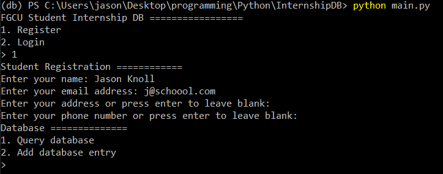

# InternshipDB
Database application for Professor Allen's Intro to Data Engineering final group project

*WARNING* This application is not complete due to time constraints. Most of the code is non-functional and is work-in-progress. Only student registration works

## Explanation
---

Although we may use the regular SQLite3 package to implement our SQL, I chose to use **SQLModel** as it acts as a high-level abstraction for SQL inside of Python. Each SQL statement has a companion python function in the package. Our DDL and DML is still provided in the `.sql` file.

## Installation
---
_Python 3.9.12 was used for this project_
_**Highly recommend using a virtual environment**_

To install all the required Python packages: 
`pip install -r reqs.txt`

To run the program in your console, use:
`python main.py`

## How to Use
---
_You don't_
Only thing working right now is student registration.

## Documentation
---
ER-Diagram:

Application Architecture Diagram: 

Text User Interface: 

